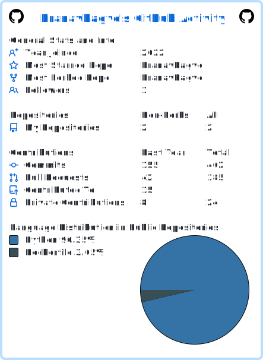

# Hi there, I'm Pranav 👋 

### Senior Software Engineer | 3.5+ Years Exp | Python, AWS and React Native 

High-performance Software Engineer specializing in **scalable cloud-native backends** and **cross-platform ecosystems**. I thrive at the intersection of robust architecture and product delivery, recently spearheading the launch of the **Jii SaaS Marketplace** (Web, iOS, & Android).

---

## 🛠️ Technical Skills

### 🚀 Backend & Core Development

### ☁️ Cloud & Infrastructure (AWS)

### 📱 Mobile & Frontend

### 🗄️ Databases

### 🧪 Quality Assurance & Automation

### ⚙️ DevOps & Tools

---

### 🚀 Highlight: Jii - SaaS Marketplace Ecosystem
*Architected and launched a production-grade marketplace for 1,000+ users.*

- **Shared Backend:** Unified FastAPI/AWS system serving Web, iOS, and Android.
- **Scalability:** Event-driven architecture using SQS/SNS, reducing latency by 35%.
- **Security:** Enterprise-grade Cognito auth with secure JWT and RBAC.
- **Management:** Led the end-to-end sync between mobile apps and the web platform.

---

### 📊 GitHub Stats

---

### 📫 Let's Connect
- **LinkedIn:** www.linkedin.com/in/pranav-bagve
- **Email:** pranavbagve3055@gmail.com
